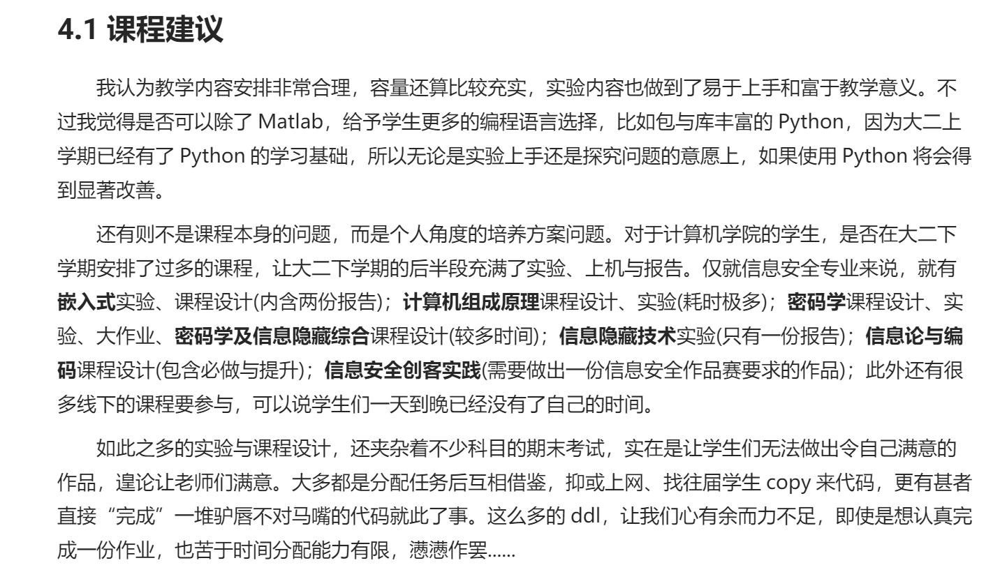
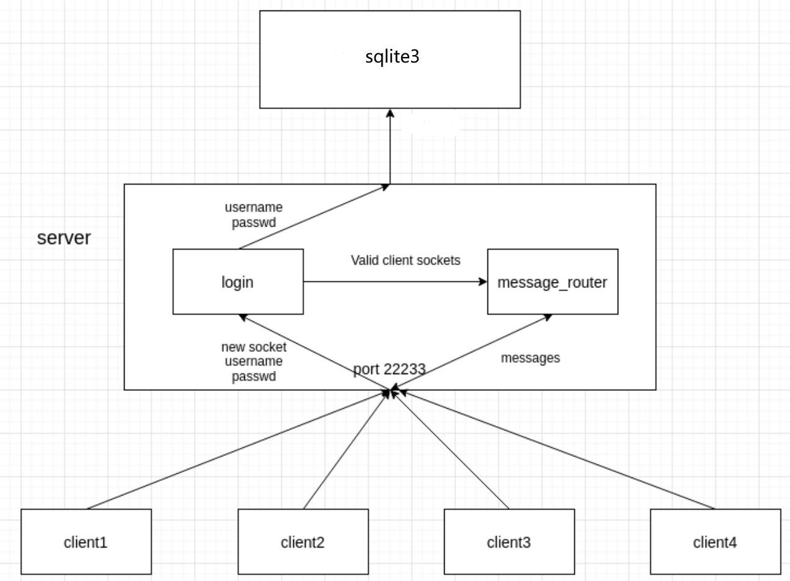
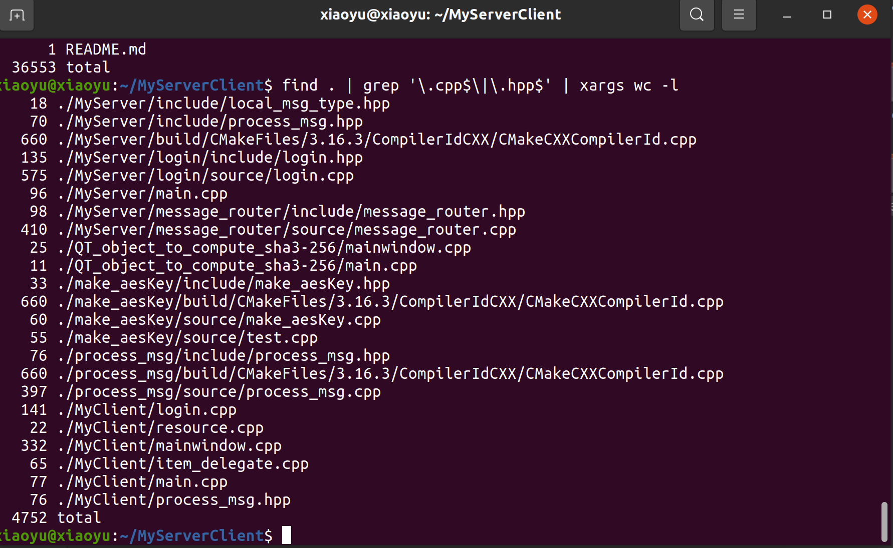
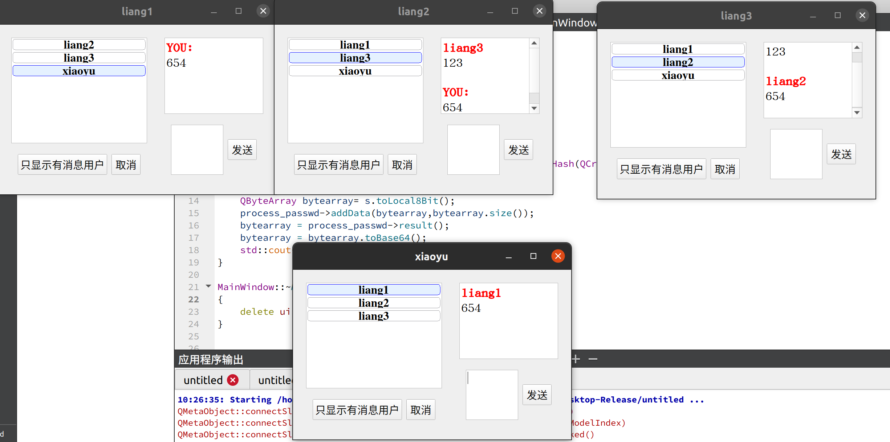
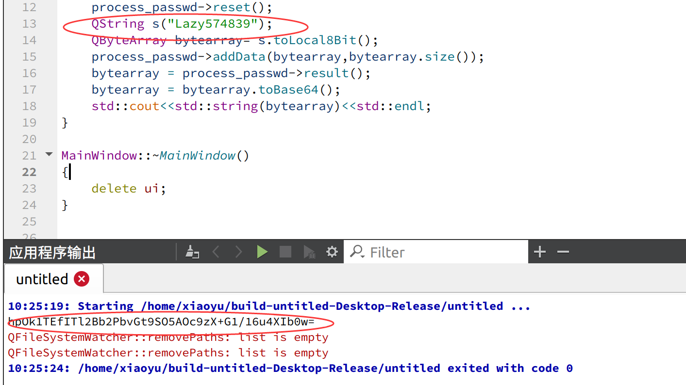

# MyServerClient 前言

本项目来源于本人的大二下学期的**密码学综合设计**。密码学这门课在期中的时候就已经结课了，当时因为在自学操作系统和计算机网络就把课内的一些课程都扔了，考试也是突击的，所以掌握的不是很牢固。而这一项综合设计是在接近学期末的时候才宣布的。当时的时间分配大致如下：



图片源自《信息隐藏技术》课程论文报告最后得课程建议。对老师的碎碎念~


时间的不充足，加上密码学原理理解的不透彻，所以动手写这么一个项目其实还是有点困难的，上网查了不少资料，也借鉴了别人的很多代码。由于 QT 不是很会，而且仅是服务端的工作量就已经比较大了，所以基于 QT 制作界面的客户端就交给了我的朋友。。

---


# Introduction 项目介绍



本项目基于开源库 Openssl 和 JSON 格式文件处理库 JsonCpp 以及轻量化数据库 sqlite3，实现了如下功能：

- 客户端针对服务端自申自签的证书进行验证，验证通过后建立 socket 连接；
- socket 建立后选择 TLS 协议，进行 SSL 握手，随后将 socket 套接字绑定至 SSL 结构，基于 TLS 协议进行安全数据传输；
- 用户在客户端输入用户名及密码，进行及时 SHA3-256 哈希计算并采用 Base64编码后，通过对称加密方式 AES-256 发送至服务器；
- 服务器通过 AES-256 解密后与 sqlite 数据库中存储的用户密码哈希值进行比对，返回用户登录状态；
- 用户登录后可以对好友列表中任意好友发送消息，由服务器收集处理并分发消息。
- 所有登录消息和消息发送的记录都记录在 resource 文件夹下的 login.log 和 message_router.log 文件中。


**代码统计**， 懒得去除 cmake 的了：



---


# Environment 环境

- OS：Ubuntu 20.04
- Compiler：g++ 9.4.0
- IDE：QTCreator 5.14.2

-----

# Technical Points 技术特点

- 使用 epoll 边沿触发的 IO 多路复用技术，非阻塞 IO；
- 使用 C++11多线程技术如 std::mutex、std::thread、std::condition_variable、std::unique_lock()等，充分利用多核 CPU；
- 定期清理超时用户，防止占用服务器资源；
- 使用 Openssl 库实现了证书验签、安全传输等功能；
- 使用 JsonCpp 读取程序中所需的文件和变量，以及客户端与服务端之间的通信内容，避免了琐碎的格式处理；
- 使用 sqlite3 数据库内嵌于 C++程序，实现了轻量、高效与简洁的用户密码存储。

---

# 运行说明


## 前期准备


### 证书申请

在 resource 目录下打开命令行，键入如下命令生成 RSA 私钥：

```shell
openssl genrsa -out private.pem 2048
```

然后键入如下命令签名证书请求文件：

```shell
openssl req -new -x509 -days 3650 -key private.pem -out cert.cert`
```

然后输入自己信息即可。


**HINT**：由于客户端验证服务端证书的时候只验证了姓名和邮箱，所以建议这里自己操作的时候要么直接用我附带的文件，要么自己申请的时候记得更改客户端那部分的属性。


---

### AES 密钥制作

在 make_aesKey 文件夹中运行一下即可，将名为 server_keys 的文件取出放置到 MyServer/resource 中。


---

### 动态库 libProcessMsg.so 制作

在 process_msg 文件夹下 cmake，把得到的 libPorcessMsg.so 取出放置到 MyServer/resource 和 MyClient/sources 中。


---

## 服务端运行指南


首先在 MyServer 目录下依次执行：

```shell
mkdir build

cd build

cmake ..

cmake --build .

mv chat_server ..

cd ..

./chat_server
```

即可完成服务端的启动。


---

## 客户端运行指南

直接使用 Qt Creator 启动即可，运行示意图如下：




---


# 服务端结构


## 登录验证部分

以 login 类的形式存在，负责开放并监听22233端口，与 sqlite3 数据库通讯，验证客户端提供的用户名密码的正确性，定期清理超时不发送数据的客户端及验证失败次数过多的客户端，分为两个线程，监听线程及定期清理线程。


## 消息转发部分

以 message_router 类的形式存在，负责接受客户端的聊天信息，并将聊天信息转发到对应的客户端。

message_router共有三个线程：

- message_worker 负责接收客户端发来的信息，简单处理后放入消息队列中;

-  message_consumer 负责从消息队列中取出消息，根据消息的类型对其进行处理（转发或者回应客户端相应请求）;

- cleaner 负责定期清理 down 掉的客户端。


---

# 关于数据库的额外说明


## sqlite3 配置以及存储数据的说明

sqlite3 配置示例：

```sqlite
CREATE TABLE users(

​ ID int PRIMARY KEY;

​ name varchar(35);

​ password varchar(64)

);
```

内含四个用户，用户名和密码分别为：

1. liang1    77777777
2. liang2    88888888
3. liang3    99999999
4. xiaoyu    Lazy574839


---

## 新添加用户的方式说明

在本项目中内嵌了一个 Qt 的小 demo，位于 **QT_object_to_compute_sha3-256** 文件夹中，**输入**是人类可读的密码，它会自动帮助你 SHA3-256 加密再用 Base64 编码**输出**出来。

大概示例如下：




得到了加密编码后的串可以到 sqlite3 数据库中进行添加用户了。


切换到文件夹 MyServer/resource 中，打开命令行，键入如下命令即可完成添加用户：

```sqlite
sqlite3 chat_db.sqlite

insert into users values(n, 'username', 'passwd');
```

其中 `n ` 为用户编号，当时建表忘了设计自增字段了。。`username`为要插入用户的用户名，`passwd` 为要插入用户的密码，是方才处理过的串。


---

完结撒花~
